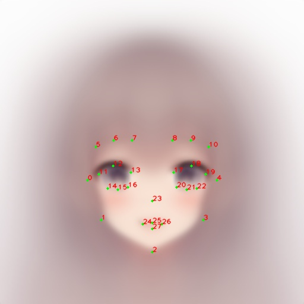
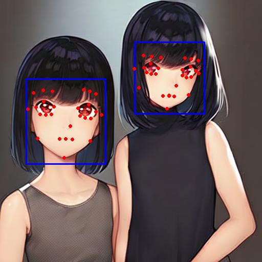

# Anime Face Detector using mmdet and mmpose

This project use pretrained model from repo [hysts/anime-face-detector](https://github.com/hysts/anime-face-detector) to detect faces and landmarks from anime image

## Environments and Libraries

- ~~Python 3.10.9~~ (I try this but got error `No module named 'lib2to3'` because of deprecation on Python 3.10)
- Python 3.9.16

Clone and install repo

``` bash
pip install -r requirements.txt -f https://download.pytorch.org/whl/torch_stable.html
mim install mmcv-full==1.5.0
mim install mmdet==2.19.0
mim install mmpose==0.21.0

export CUDA_VER=11.8
export PATH=/usr/local/cuda-$CUDA_VER/bin:$PATH
export LD_LIBRARY_PATH=/usr/local/cuda-$CUDA_VER/lib64${LD_LIBRARY_PATH:+:${LD_LIBRARY_PATH}}
export CUDA_HOME=/usr/local/cuda-$CUDA_VER

git clone https://github.com/hysts/anime-face-detector.git
pip install -e anime-face-detector # it take 10+ min to build mmcv-full

# reinstall if need
# mim install mmcv-full==1.5.0
# mim install mmdet==2.19.0
# mim install mmpose==0.21.0
```

## Inference

Simply run:

``` bash
python infer.py
```

## Results

The model detects near-frontal anime faces and predicts 28 landmark points.



<sub> (*Source*: https://github.com/hysts/anime-face-detector) </sub>

Some inference result

| Image | Result |
|:---:|:---:|
|  |  |

